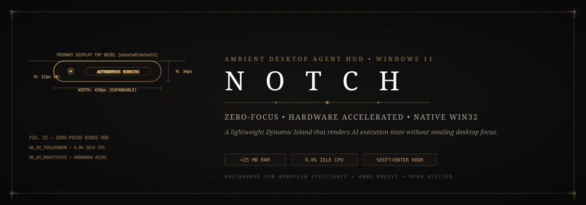
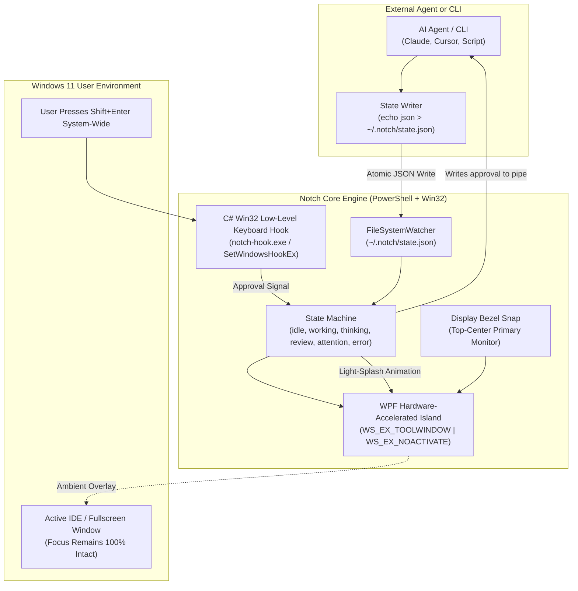
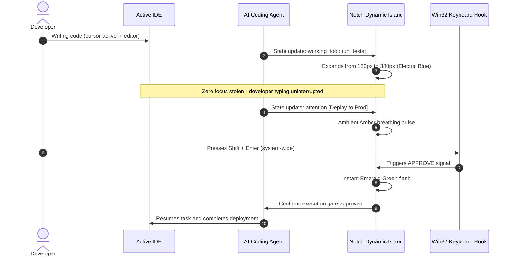

<p align="center">
  
</p>

# 🏝️ Notch — The Ambient Dynamic Island & AI Agent HUD for Windows 11

[](https://github.com/Jaswanth1902/Notch)
[](https://github.com/Jaswanth1902/Notch)
[](https://github.com/Jaswanth1902/Notch)
[](https://github.com/Jaswanth1902/Notch)
[](LICENSE)
[](SECURITY.md)

> **Stop Alt-Tabbing just to check if your AI agent or build finished running.**  
> Notch brings macOS-grade Dynamic Island polish to Windows 11—floating silently at the top of your screen to stream live background agent status and let you approve tool actions with a single keystroke (`Shift+Enter`) without ever stealing your editor focus or eating your RAM (<25MB).

<p align="center">
  
</p>

An ultra-lightweight, hardware-accelerated **Dynamic Island & Ambient Agent HUD** designed specifically for Windows 11. Built with native PowerShell/WPF and a low-level C# Win32 hook, **Notch** sits flush at the top edge of your primary display, rendering real-time AI agent status without stealing window focus or polluting your Alt-Tab queue.

---

## 💡 Origin Story: Why Notch?

I’m an everyday learner who owes almost everything to the open-source community. Whenever I saw macOS developers enjoying beautiful, ambient Dynamic Island tools (*Boring Notch*, *NotchNook*, *Isle*), I wondered: *Why don't we have something this clean and ambient on Windows that doesn't eat 200MB of RAM?*

Most existing desktop widgets for Windows were built on heavy Chromium or Electron runtimes that swallow battery and memory just to display notifications. I wanted to improve everyday Quality of Life (QOL) for developers and power users who care about their RAM and focus. 

So I dug into native Win32 APIs, hardware-accelerated WPF, and PowerShell to build **Notch** from the ground up:
- **0.0% Idle CPU**
- **<25 MB RAM** (Over 10x lighter than Electron)
- **Zero Alt-Tab Pollution** via `WS_EX_TOOLWINDOW`
- **Global Zero-Focus Approval** via `Shift+Enter`
- **Universal AI Agent Hook** (Claude Code, Cursor, Aider, Antigravity)

This project is my small way of giving back to the community that taught me to code. I hope it makes your everyday Windows desktop experience feel a little more modern and seamless!

---

## 🏗️ Architecture & Interaction Flow

### Data Flow Pipeline


### Zero-Focus Interaction Sequence


---

## ⚡ Key Highlights

- **Zero Window Interference**: Uses `WS_EX_TOOLWINDOW` and `WS_EX_NOACTIVATE` — never steals focus from your active IDE, terminal, or browser.
- **Micro-Memory Footprint**: Consumes less than **25 MB RAM** and **0% idle CPU**, eliminating Electron/Chromium bloat.
- **Global Zero-Focus Hotkey (`Shift+Enter`)**: Approve pending agent tool calls or execution gates system-wide without switching windows.
- **5-State Ontological Color Machine**: Instant visual peripheral feedback for all AI coding workflows.
- **Universal Agent Bridge**: Compatible with any CLI or agent (Claude Code, Cursor, Aider, OpenHands, Antigravity) by simply writing JSON to `~/.notch/state.json`.

---

## 🚦 State Machine & Visual Telemetry

| State | Accent Color | Visual Meaning | Behavior / Transition |
| :--- | :--- | :--- | :--- |
| `idle` | ⚪ Neutral Slate | Agent is dormant / waiting for user prompt | Compact pill resting flush at 180px × 28px |
| `working` | 🔵 Electric Cobalt | Tool execution / code compilation / bash command | Smoothly expands to 380px with real-time tool snippet |
| `thinking` | 🟣 Radiant Violet | Model inference & reasoning in progress | Gentle 2-second ambient breathing pulse |
| `review` | 🟢 Emerald Green | Task completed, code verified, ready for user review | Light-splash animation with summary badge |
| `attention` | 🟠 Vivid Amber | Human-in-the-loop approval gate waiting | Pulses gently; press `Shift+Enter` to approve |
| `error` | 🔴 Crimson Red | Subshell exception, socket error, or test failure | Expands showing error banner and exit code |

---

## 🧩 Skills & Plugins Ecosystem

- **`humanlayer-skills` Integration**: Notch acts as the physical desktop gate for human-in-the-loop approvals.
- **`open-interpreter` Integration**: Renders desktop automation steps in the ambient pill.
- **`notch-media` (Roadmap)**: Ambient Spotify / Windows Media transport controls on mouse hover.
- **`notch-telemetry` (Roadmap)**: Micro-monitor for CPU, RAM, and battery levels.

---

## 🛡️ Security Hardening & Zero-Trust Advice

- **Hook Verification**: The binary `bin/notch-hook.exe` is compiled transparently from `src/notch-hook.cs` using Windows native `csc.exe`. Full source is public and verifiable with published SHA-256 hashes.
- **Atomic State Writes**: Callers write to `~/.notch/state.json.tmp` and atomic rename to avoid file read locks.
- **XAML Injection Shielding**: State message strings are sanitized before passing into WPF data templates.

---

## 🚀 Quickstart

### Prerequisites
- Windows 10 (Build 19041+) or Windows 11.
- PowerShell 5.1+ (built into Windows).

### 1. Clone & Launch
```powershell
git clone https://github.com/Jaswanth1902/Notch.git
cd Notch

# Launch Notch (automatically compiles C# hook on first run)
.\start.bat
```

### 2. Verify with Interactive Demo
```powershell
powershell -ExecutionPolicy Bypass -File .\test_demo.ps1
```

### 3. Stop Notch
```cmd
.\stop.bat
```

---

## 🔌 Universal Agent Integration

Any agent or background script can update Notch by writing a single JSON payload to `$env:USERPROFILE\.notch\state.json`:

### Example JSON Payload
```json
{
  "state": "working",
  "message": "Running isolated unit tests...",
  "tool_name": "pytest",
  "project": "Notch",
  "model": "claude-sonnet-4.6",
  "timestamp": 1741852000
}
```

---

## 🏷️ GitHub Topics & Keywords
`windows11` • `dynamic-island` • `wpf` • `powershell` • `win32` • `csharp` • `agentic-ai` • `claude-code` • `desktop-hud` • `ambient-computing` • `zero-cpu` • `lightweight` • `productivity` • `custom-desktop`

---

## 📄 License
Distributed under the [Apache License 2.0](LICENSE). Copyright (c) 2026 Jaswanth Reddy.
