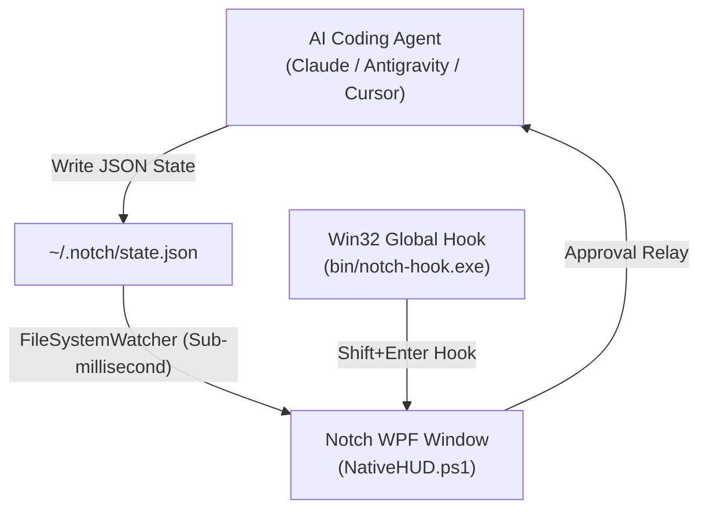

# 🏝️ Notch — The Ambient Dynamic Island & AI Agent HUD for Windows 11

[](https://github.com/Jaswanth1902/Notch)
[](https://github.com/Jaswanth1902/Notch)
[](https://github.com/Jaswanth1902/Notch)
[](https://github.com/Jaswanth1902/Notch)
[](LICENSE)

An ultra-lightweight, hardware-accelerated **Dynamic Island & Ambient Agent HUD** designed specifically for Windows 11. Built with native PowerShell/WPF and a low-level C# Win32 hook, **Notch** sits flush at the top edge of your primary display, rendering real-time AI agent status without stealing window focus or polluting your Alt-Tab queue.

```
       ┌────────────────────────────────────────────────────────┐
       │   ✦ WORKING   [task-observer]   Running lint... (1.2s) │
       └────────────────────────────────────────────────────────┘
                                 ▲
               28px OLED Screen-Flush Dynamic Island
```

---

## 💡 Origin Story: Why Notch?

Desktop Dynamic Islands and ambient HUDs have flourished on macOS (*Boring Notch*, *NotchNook*, *Isle*). But Windows users were completely left behind — stranded with either clunky system tray icons or bloated Electron wrappers that hog 200MB+ of RAM just to show a status badge.

I built **Notch** from scratch as a sovereign solo developer tool: the first native, screen-flush OLED Dynamic Island and Agent HUD engineered specifically for Windows 11. By pairing hardware-accelerated WPF with a low-level C# Win32 keyboard hook, Notch achieves:
- **0.0% Idle CPU**
- **<25 MB RAM** (10x lighter than Electron)
- **Zero Alt-Tab Pollution** via `WS_EX_TOOLWINDOW`
- **Global Zero-Focus Approval** via `Shift+Enter`
- **Universal AI Agent Hook** (Claude Code, Cursor, Aider, Antigravity)

---

## ⚡ Key Highlights

- **Zero Window Interference**: Uses `WS_EX_TOOLWINDOW` and `WS_EX_NOACTIVATE` — never steals focus from your active IDE, terminal, or browser.
- **Micro-Memory Footprint**: Consumes less than **25 MB RAM** and **0% idle CPU**, eliminating Electron/Chromium bloat.
- **Global Zero-Focus Hotkey (`Shift+Enter`)**: Approve pending agent tool calls or execution gates system-wide without switching windows.
- **5-State Ontological Color Machine**: Instant visual peripheral feedback for all AI coding workflows.
- **Universal Agent Bridge**: Compatible with any CLI or agent (Claude Code, Cursor, Aider, OpenHands, Antigravity) by simply writing JSON to `~/.notch/state.json`.

---

## 🚦 State Machine & Visual Telemetry

| State | Accent Color | Visual Meaning | Behavior / Transition |
| :--- | :--- | :--- | :--- |
| `idle` | ⚪ Neutral Slate | Agent is dormant / waiting for user prompt | Compact pill resting flush at 180px × 28px |
| `working` | 🔵 Electric Cobalt | Tool execution / code compilation / bash command | Smoothly expands to 380px with real-time tool snippet |
| `thinking` | 🟣 Radiant Violet | Model inference & reasoning in progress | Gentle 2-second ambient breathing pulse |
| `review` | 🟢 Emerald Green | Task completed, code verified, ready for user review | Light-splash animation with summary badge |
| `attention` | 🟠 Vivid Amber | Human-in-the-loop approval gate waiting | Pulses gently; press `Shift+Enter` to approve |
| `error` | 🔴 Crimson Red | Subshell exception, socket error, or test failure | Expands showing error banner and exit code |

---

## 🚀 Quickstart

### Prerequisites
- Windows 10 (Build 19041+) or Windows 11.
- PowerShell 5.1+ (installed by default on Windows).

### 1. Clone & Launch
```powershell
git clone https://github.com/Jaswanth1902/Notch.git
cd Notch

# Launch Notch (automatically compiles C# hook on first run)
.\start.bat
```

### 2. Verify with Demo Mode
```powershell
# Run the interactive state-cycle demo
powershell -ExecutionPolicy Bypass -File .\test_demo.ps1
```

### 3. Stop Notch
```cmd
.\stop.bat
```

---

## 🔌 Universal Agent Integration

Any agent or background script can update Notch by writing a single JSON payload to `$env:USERPROFILE\.notch\state.json`:

### Example Payload
```json
{
  "state": "working",
  "message": "Running isolated unit tests...",
  "tool_name": "pytest",
  "project": "Notch",
  "model": "claude-sonnet-4.6",
  "timestamp": 1741852000
}
```

### Bash / Zsh / PowerShell One-Liner
```powershell
# Update from PowerShell
@{ state = "working"; message = "Compiling Rust crate..."; tool_name = "cargo" } | ConvertTo-Json | Set-Content "$env:USERPROFILE\.notch\state.json"
```

```bash
# Update from WSL / Git Bash
echo '{"state":"review","message":"All 48 tests passing"}' > "$USERPROFILE/.notch/state.json"
```

---

## 🏗️ Architecture



- **`NativeHUD.ps1`**: Pure PowerShell WPF application leveraging `System.Windows.Interop.HwndSource` for window management.
- **`notch-hook.cs`**: High-performance Win32 keyboard hook compiled via Windows native `csc.exe`.

---

## 🛠️ Compiling from Source

Notch includes its own zero-dependency compilation script using the built-in Windows C# compiler:
```powershell
powershell -ExecutionPolicy Bypass -File .\build.ps1
```

---

## 📄 License

Distributed under the [MIT License](LICENSE). Copyright (c) 2026 Jaswanth Reddy.
