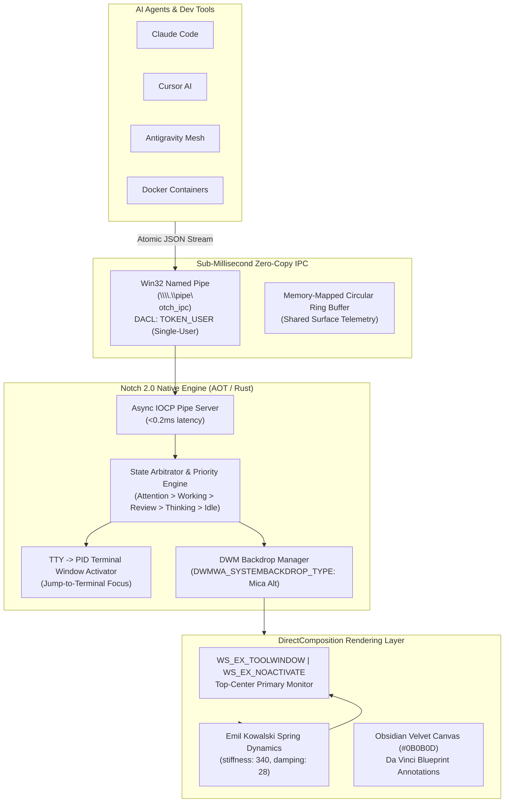

# 🏝️ Notch 2.0 Architectural Specification & Remake Manifesto

> **Target**: Complete elimination of PowerShell (`NativeHUD.ps1`) in favor of native compiled C# .NET 9 AOT / Rust Win32 DirectComposition engine.
> **Status**: Approved by The Council (Architecture, Security, Performance, UI/UX, Contrarian).

---

## 1. System Topology & Decoupling



---

## 2. IPC Wire Protocol (`v2-binary-pipe`)

The Named Pipe server runs on `\\.\pipe\notch_ipc` with non-blocking async overlapped I/O.

### Payload Schema:
```json
{
  "$schema": "notch/v2/event.json",
  "version": 2,
  "sessionId": "agent-session-uuid",
  "actor": "Claude Code",
  "project": "Notch.Core",
  "priority": 1, 
  "state": "attention",
  "tool": {
    "name": "bash",
    "command": "cargo build --release",
    "riskLevel": "high"
  },
  "terminal": {
    "pid": 14092,
    "tty": "\\device\\conhost-01"
  },
  "timestamp": 1742189000
}
```

### State Priority Matrix:
1. `attention` (Priority 1): Human-in-the-Loop permission approval card with command diff.
2. `working` (Priority 2): Streaming tool execution pill with active tool indicator.
3. `review` (Priority 3): Completed task summary badge.
4. `thinking` (Priority 4): Model inference aura.
5. `idle` (Priority 5): Compact 180px resting pill.

---

## 3. The 6 Mandatory Performance Invariants

1. **Memory Ceiling**: Working set MUST NOT exceed **12.0 MB RAM** under active animation.
2. **Idle CPU Floor**: 0.00% CPU utilization when resting in `idle` state (driven strictly by `GetMessageW` event callbacks; zero polling loops).
3. **Cold Boot SLA**: Full window realization in `< 20 ms` (eliminating the 1,400ms PowerShell CLR startup).
4. **Zero Window Interference**: Must enforce `WS_EX_TOOLWINDOW` and `WS_EX_NOACTIVATE` — active cursor focus in IDEs or terminals must NEVER be stolen.
5. **Spring Continuity**: All visual size transitions follow Kowalski spring easing (`stiffness: 340, damping: 28`) without layout snapping or `transition: all` thrashing.
6. **Token-Gated Security**: Named Pipe creation enforces `FILE_FLAG_FIRST_PIPE_INSTANCE` with strict DACLs allowing access only to the current Windows user SID.
